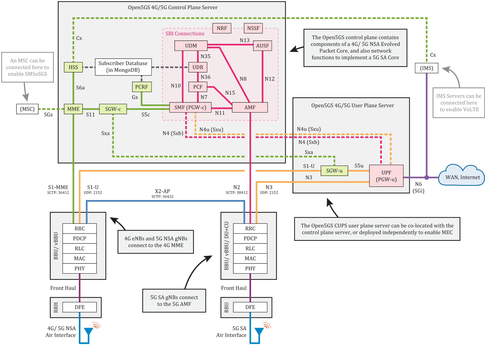

## 5G SA Core Services



- Control Plane (AMF - Access and Mobility Management Function): manages mobility, authentication, and session management, ensuring secure and efficient communication. 
    - **NRF** (NF Repository Function) - Registers the locations (IP addresses) of all other core services and does location lookups when one core services needs to communicate with another. 
    - **SCP** (Service Communication Proxy) - Routes messages messages between core services if direct communication is not possible.
    - **SMF** (Session Management Function) - Sets up connection to the Internet when UE tries to connect to the Internet.
    - **AUSF** (Authentication Server Function) - Authenticates subscriber information, e.g., checking if a SIM card's information is valid.
    - **SEPP** (Security Edge Protection Proxy) - Secures communication between two different mobile networks.
    - **UDM** (Unified Data Management) - Handles subscription management and authorization, etc. 
    - **UDR** (Unified Data Repository) - Serves as a centralized data repository. Stores subscriber data, policy data, session data, application data, etc. 
    - **PCF** (Policy Control Function) - Applies policies for charging, [QoS](https://www.fortinet.com/resources/cyberglossary/qos-quality-of-service), and resource allocation, ensuring data prioritization.
    - **BSF** (Binding Support Function) - Stores and serves subscriber-PDU bindings, so NF/AFs can find the correcrt PCF instance handling a specific session. 
    - **NSSF** (Network Slice Selection Function) - Manages [network slicing](https://en.wikipedia.org/wiki/5G_network_slicing), allocating virtual networks for specific services like IoT and HD video.

- User Plane (UPF - User Plane Function): carries user data packets between the cell and the external WAN. It contains only: 
    - **UPF** - Does data forwarding. It connects back to SMF.

## Call Flow

- SBIs. All NFs in the Control Plane use a common bus to exchange control plane messages between each other. Each NF uses their own SBI (Service Based Interface) to connect to this common bus.
- UE and gNB makes [PDU](https://5gworldpro.com/5g-knowledge/what-is-pdu-session-in-5g.html/) session establishment request to AMF.
- AMF selects the best SMF and sent a session management context create request to SMF.
- 

NGAP (Next-Generation Application Protocol) is a Control Plane protocol signaling between gNB and the AMF. 

## Roaming

There are two types of 5G Roaming (both are supported by Open5GS):
- LBO (Local Breakout): User plane traffic is routed directly through the visited network's UPF, without going through the home network.
- HR (Home Routed): User plane traffic is routed back to the home network's UPF through the visited network. 

We have a home network and a visited network, where the inter-network communications is entirely handled by Open5GS. The UE is registered in the home network.

## Notes

It'd be helpful to figure out the steps of how Open5GS and srsRAN handles the initial communication with each other. The cell PLMN validation process should happen there.

In practice, we can try entering a mismatched PLMN in the gNB configuration file and see which service reports errors. It will likely be the one that we want to modify.

Based on eyeballing service responsibilities, I would guess AUSF and UDM/UDR are our targets. 

```log
core  | 12/26 23:49:57.892: [amf] WARNING: NG-Setup failure: (../src/amf/ngap-handler.c:390)
core  | 12/26 23:49:57.892: [amf] WARNING:     globalGNB_ID PLMN-ID is foreign (../src/amf/ngap-handler.c:391)
cu    | "NG Setup Procedure" failed. AMF NGAP cause: "unknown-PLMN-or-SNPN"
cu    | srsRAN ERROR: CU-CP failed to connect to AMF
core  | 12/26 23:49:57.974: [amf] INFO: gNB-N2[127.0.0.1] connection refused!!! (../src/amf/amf-sm.c:997)
```

Tracing down to `src/amf/amf-sm.c`. The struct `gnb` is initialized in this file, and is then passed to `ngap-handler.c`. 

There is case switching on `switch (e->h.id)`, where one of the case is our connection refused. 
- We should look into `amf_sm_debug` (which seems to be a thin wrapper around `ogs_debug`) and `ogs_assert`. 

Open5GS checks PLMN defined from RAN in `lib/ngap/build.c`. 

If we do a search for keyword `PLMN`, notably these files show up: 
- `lib/proto/types.c` which I think manipulates type conversion between RAN data types and Open5GS data types. It includes `ogs-proto.h`. Whoever uses this file should be responsible for setting up PLMN in Open5GS.
- `lib/sbi/conv.c` which has a function called `ogs_sbi_build_plmn_id` and I think is a pretty important initializer for something. Might want to see where SBI is in the call flow. 
- `lib.sbi/message.c` which has lots of mentions to PLMN but I'm not sure if it's very important. Bonkers.
- `lib/sbi/openapi/model/access_token_req.c` which takes requester PLMN in `OpenAPI_access_token_req_create` to create `access_token_req_local_var`. This also seems pretty early in the call flow. I'm just not yet sure where access tokens are used and what exactly they mean.
- `lib/sbi/openapi/model/cell_global_id.c` Huge. It seems like I just need to find out where type `OpenAPI_plmn_id_t` is first defined and used. Exciting. Exciting. Exciting. Exciting. Exciting. Exciting.
- `plmn_id.h` and `gnb_id.h` should just be type definition files I believe. I will hardcode the PLMN so that **hopefully** Open5GS will broadcast PLMN 99999 while the running gNB PLMN is 00101. 
- `lib/sbi/openapi/model/data_set_id.c` which contains a function called `OpenAPI_data_set_id_FromString`, but I think it gets its values from command line.
- `lib/sbi/openapi/model/global_ran_node_id.c` I think this is what we are ultimately looking for.

My major concern is that maybe the PLMN is simutaneously passed into multiple core services. However, from the service chart it seems like everything should have to first go through AMF via N2 (which I'm not sure what it means) and this is where NGAP lives.

## Open5GS Source Code Rebuild

Still working on mounting the source code from host to container in the `mount` branch.
```bash
# rebuild
cd open5gs-dev
ninja -C build
# optionally check if build compilation is correct
cd build
# if there are changes made to the configuration files, delete install dir and start over
rm -Rf ../install
ninja install
```