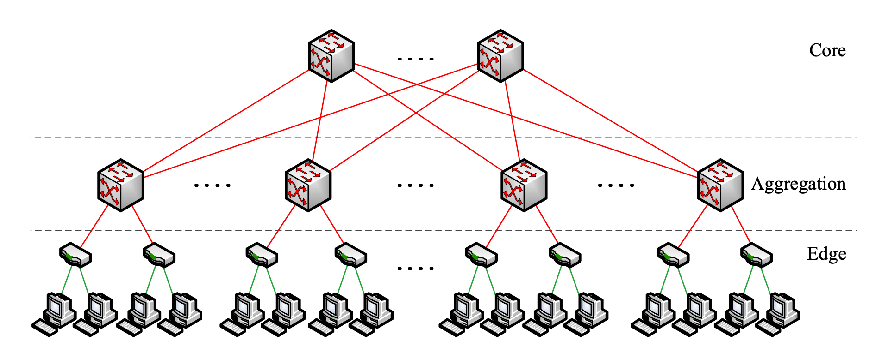

[switches v.s. routers](https://www.cisco.com/c/en/us/solutions/small-business/resource-center/networking/network-switch-vs-router.html#~introduction) - switches *connect devices* in a single local network, using MAC addresses; routers *connects local networks* to form larger ones, using IP addresses. 

[bisection bandwidth](https://ayarlabs.com/glossary/bisection-bandwidth/) - partition the networks nodes in two groups such that the bandwidth between them is the smallest; this is a measurement of network performance at its *limit*--if all packets have to cross the cut, the heaviest communication (half) must go through the fewest possible paths. 

[oversubscription](https://networkengineering.stackexchange.com/questions/60002/what-is-oversubscription-in-networking) - $\frac{\text{worst aggregate bandwidth}}{\text{bisection bandwidth}}$ just cuz we think there won't be so much traffic coming up from endhosts at the same time into the leaf switch, its uplink doesn't need to support it fully. if there's a switch w/ 48 ports each takes 1gbs, and uplink supports 10gbs, the oversubscription ratio would be $4.8:1$.

layers - one more layers support exponentially more endhost, but i guess there's a reason why going over three layers is not desirable, possibly because higher level switches cannot support that much bandwidth coming from below. 

ecmp - does not account for path bandwidth assigning flows to paths.

Today's network architecture cannot fully support the increasing aggregate bandwidth requirements from endhosts (so it's a waste of end bandwidth). Same problem shows up in inter-node communication in large datacenter clusters. One direction towards fixing this problem is using specialized routers and switches that support larger bandwidth; but it's very expensive, has compatibility issues with TCP/IP (why?), and yet still only suffice 50% of endhost's demand. The other direction is using commodity ethernet switches (what did they use before this?) but scales poorly. Since neither solution is good enough, the author proposes one that addresses all the shortcomings (it's commodity, scalable, compatible w/ other layers). 

Current datacenters typically use a three-layer tree structure. 