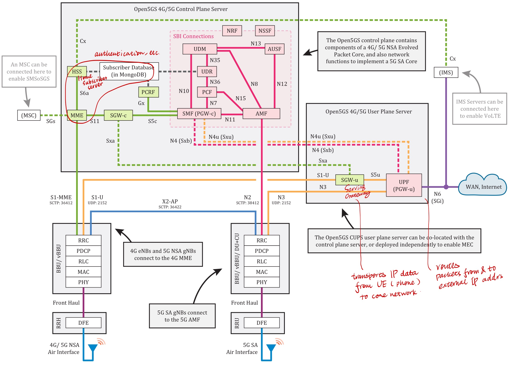
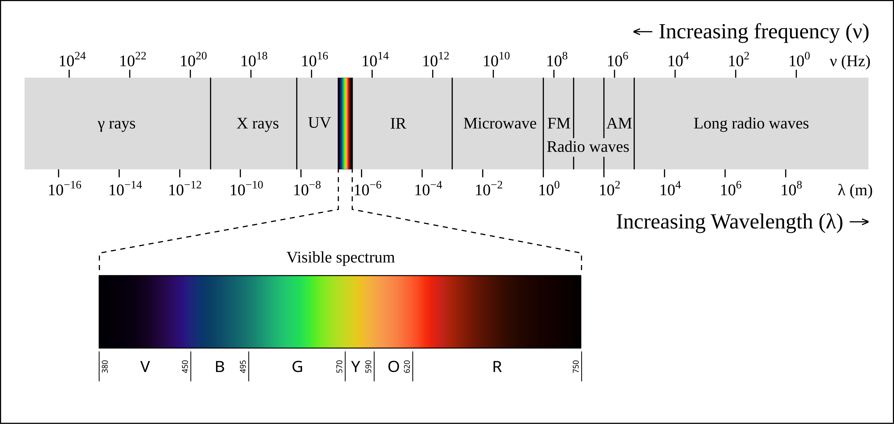
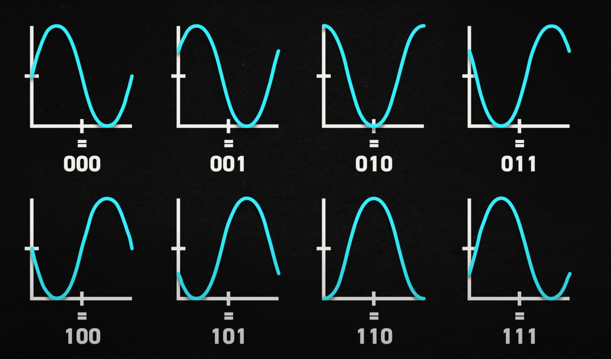

Notes - uhd building from source is also being weird. so rn we use the 4.9.0 release. **but i believe the 4.0.0 or 3.1.5. are the ones compatible with srsran** (rn with 4.9.0 there's an error when building srsran but it can be fixed by adding a line which is sketchy ig) -- so def switch back to that later if curr setup works. 

open5gs build from source is also buggy. there is a open5gs vonr error that idk where it's from. trying with package (did not config logging, but that'll only affect journalctl prints ig so it's not a big deal; also webui is facing some troubles because srsran_proj does not have a release, i have to remove its ppa before **running(???)** the open5gs web page)

---
## Flow
user equipment (phone + sim) → \[sends radio signal to] → base station/cell tower (gNB made by usrp + ghd as hardware driver + srsran) → goes into open5gs core → sets up WAN connectivity so user plane reaches the actual internet

---
## Open5GS
Overview - is a software that builds the authenticating and routing for a cellular network (the signal processing stuff are handled by srsRAN, described below); supports both 4G/LTE and 5G networks.

I think each `.yml` file in the root folder corresponds to each of these modules. 



- Control plane: contains the authenticator, database (mongodb; for storing subscriber info), 
- User plane: does some data transmission stuff. 
### 5G non standalone v.s. 5G standalone
former deploys 4G control plane infrastructures (like base stations) with higher data transfer rate; latter has its own dedicated hardware.
- read more [here](https://www.netscout.com/what-is/5g-sa-vs-nsa)
- the frequency band (range of radio frequency; bandwidth lol) used by 4g/5g is region specific, but 5g typically has a much larger bandwidth than 4g. 
### mme & amf
MME (mobility management entity; 4G) & AMF (authentication management field; 5G) - does authentication and registration and track location, etc. It needs
- set `plmn` (public landline mobile network; is a comb of mcc and mnc) 
	- takes the format: `mnc<MNC>.mcc<MCC>.gprs` (e.g., `mnc12.mcc345.gprs`)
		- MCC (mobile country code)
			- e.g., see [3166 countries w/ regional code](https://github.com/lukes/ISO-3166-Countries-with-Regional-Codes/blob/master/all/all.csv) from ISO (international standardization organization)
		- MNC (mobile network code) 
			- see this [list](https://www.mcc-mnc.com/)
		- test: `001/01`
- set `tac` (track area code; changes when user move from an area to another)
- set `ip addr` (configure connection from base station to my laptop running the software)
	- but since both srsran and open5gs runs on the same laptop there's no need to config network here? or i pick one of the loopback addresses. 
### apn & dnn
**APN** (access point name) & **DNN** (data network name) - APN in EPS (powers 3G) is the same as DNN in 5G. 
- APN is composed of two parts:
	- APN network id (*mandatory*) - defines to which external network the GGSN/PGW is connected and optionally a requested service by the MS. This part of the APN is mandatory.
	- APN operator id (*optional*) - defines in which PLMN GPRS/EPS backbone the GGSN/PGW is located
### setting up WAN connectivity
1. enable IP forwarding:
```
$ sudo sysctl -w net.ipv4.ip_forward=1
$ sudo sysctl -w net.ipv6.conf.all.forwarding=1
```
- so that this machine no longer acts as an endhost in network but a router that forwards from the user device (phone) to wider internet. 

2. add NAT Rule 
```
$ sudo iptables -t nat -A POSTROUTING -s 10.45.0.0/16 ! -o ogstun -j MASQUERADE
$ sudo ip6tables -t nat -A POSTROUTING -s 2001:db8:cafe::/48 ! -o ogstun -j MASQUERADE
```
- see [man page](https://man7.org/linux/man-pages/man8/iptables.8.html) for everything. 
- `-t nat`: use NAT; can also do `-t filter`, etc.
- `-A POSTROUTING`: alters packets as they are about to go out by appending rules.
- `-s`: specifies source; so any packets coming from these source ips `10.45.0.0/16` are gonna abide the following rules. 
- `-o `: name of an interface via which a packet is going to be sent; when the "!" argument is used before the interface name, the sense is inverted; so phone packet is NOT going back out through ogstun, then masquerade it. 
- `-j MASQ` give these packets the ip address of the server running open5gs. 

GPRS (General Packet Radio Services) - is 2.5G network. It's the first to move from circuit-switched data to packet-switched data. 
- GGSN (Gateway GPRS Support Node) supports it.

---
## USRP & UHD
Overview - USRP and antenna is the hardware part that receives and transmit radio signals;
UHD (stands for usrp hardware driver) is just a driver that talks in between hardware and srsRAN (which does all the signal processing part).
- refer to the [official guide](https://kb.ettus.com/B200/B210/B200mini/B205mini/B206mini_Getting_Started_Guides). 
### turning digital data into radio waves
some radio waves have very high frequency (like x-ray or gamma-ray) and longer radio waves are what we are looking at here (like wavelength $\lambda$ in the unit of meters).
- shorter ones carries more energy and can penetrate some obstacles (like human body). 
- longer ones can move around obstacles and travel across long distances. 

- [cool vid](https://www.youtube.com/watch?v=whEqaxlCVSs) and [cooler vid](https://youtu.be/0faCad2kKeg?si=HRHab9LSmF8bvc1_)
	- AM (amplitude modulation) & FM (frequency modulation)![[amfm.png]]
	- some cool encoding that translates from waves to binaries (but 8 phases is usually the limit, anything higher than that it's hard to distinguish)
	- what's cooler is that amplitude can also be modified so that the can be more distinctions thus more bits in one wave.
### RF frontend
is a word for all the circuitry that converts radio signals to some kind of intermediate signal form (before they become electric).  
### software defined radio
after getting the radio signals from hardware, but most processing (such as modulation) are done by software as opposed to having dedicated circuitry in a traditional radio. so there must be something **in the hardware** that converts signals **from radio to digital**. 

---
## srsRAN
Overview - the software part of software defined radio; does the modulation and all the processing type things; what comes out of it gets passed into open5gs and gets routed into real internet. 
### RAN
Radio access network (RAN) - it's a mobile device network that connects to end-users. 
- Virtualized RAN (vRAN) - no longer requires proprietary hardware to run but instead runs on any general server.
- Open RAN (O-RAN) - Container-based and cloud-native implementation of vRAN. 
### installation guide
```
1. Install dependencies
2. Install RF driver (only required for Split 8 deployments)
3. Clone the repository
4. Build the codebase
```

notes - example configs can be found at `/usr/share/srsran` 
### split 8 & split 7.2  
i think it's a separation of functions where split 8 has their hardware with uhd separated out instead of having everything in a big chunk in 7.2.

